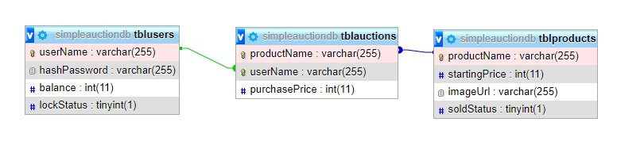

# Đề bài

  
  
  

  

# Database

## Cú pháp function handle trong server
| Cú pháp | Luồng dữ liệu | Ví dụ | Mô tả |
|---| --- | --- | --- |
| SIGNIN;username;passwd | Client -> Server | SIGNIN;Test;test | đăng nhập | 
| exit | Client -> Server | Client thoát khỏi Server | Thoát khỏi lobby |
| UserWin;UserName;Bid; | Server -> Client | UserWin;User_1;9999 | Thông tin ngnười chơi thắng |
| FailAuction; | Server -> Client | FailAuction; | Phiên đấu giá thất bại |
| Product;ProductName;StartingPrice;Time;urlImage | Server -> Client | Product;ProductName;StartingPrice;Time;urlImage | Thông tin đấu giá |
